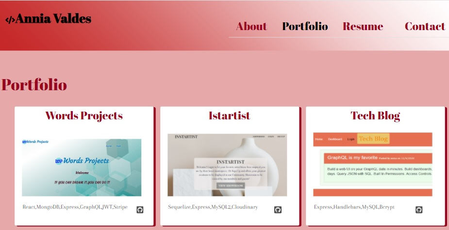

# REACT PORTFOLIO

  

# Description

The **portfolio** is the resume of my career as developer. You can read about me,the activities I did and continue to do. Show information about my studies and currently. You can see my recent projects,resume and contact me through different means.

  
 
 _____________________________________________________________________
 Visit the site! [Portfolio](https:)

 
# License
The license for which the application is covered:
NONE 

# Technologies 
 - HTML
- CSS
- REACT.JS
- REACT-BOOTSTRAP

# Questions

  If you have questions about the project, below you can find ways to answer them, either by visiting my highub or contacting me by email
  
  Link to my Github: [anniavd](https://github.com/anniavd)

  
  Email acount: [annia.valdesd@gmail.com](mailto:annia.valdesd@gmail.com)
    
